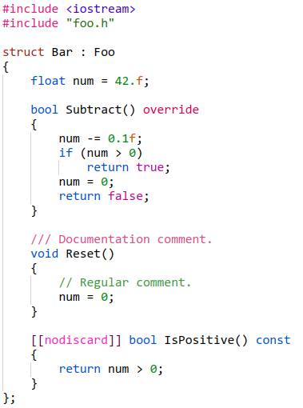

A VSCode extension providing a custom C++ grammar, and a light color theme tailored to this grammar (based on the built-in `Light+`).

 
(font: [Monocat 6x12](https://github.com/HolyBlackCat/monocat-fonts))

**Goals for the grammar:**

* Conform to the *standard C++* as much as possible.

* Highly customizable highlighting.

  Keywords are separated into dozens of categories, grouped by their meaning. Each category can be styled separately.

  Parts of tokens can be styled very precisely. If you want `+` in `12.34e+56` to be styled differently from the rest of the token, you can do it.

* It should be as simple as possible.

  Attempting to do advanced C++ parsing in a grammar is silly. I'm not going to try to highlight function/class/namespace names, and such. If you want semantic highlighting, install an extension that does it properly.

**Goals for the color theme:**

* Avoid using too many colors.

* High contrast.

  I want the theme to be legible even at the tiniest font sizes.

**Installation:**

The custom grammar automatically overrides the default C++ grammar. The langauge name is changed to `C++'` to indicate that.

The color theme has to be enabled manually:

<kbd>Ctrl</kbd>+<kbd>Shift</kbd>+<kbd>P</kbd> ▶ Preferences: Color Theme ▶ Cat's Light.
